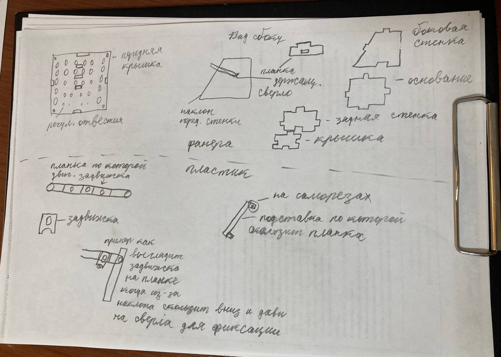
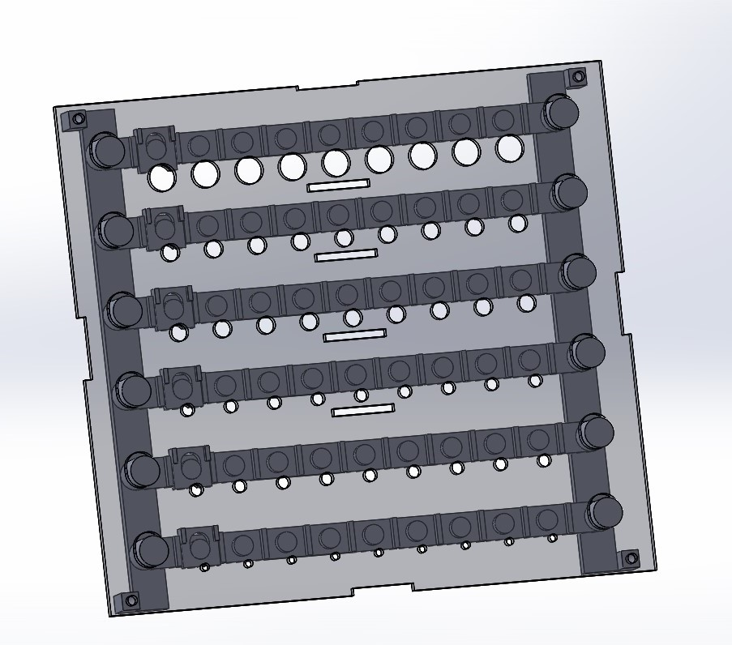
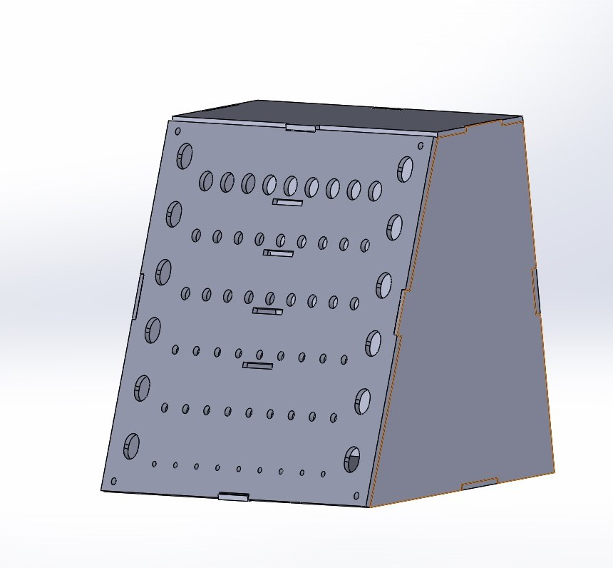
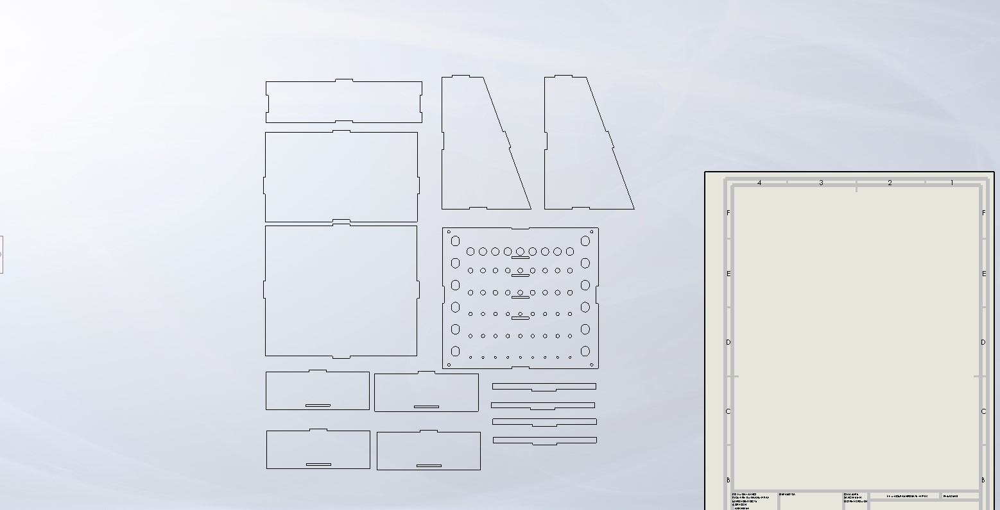
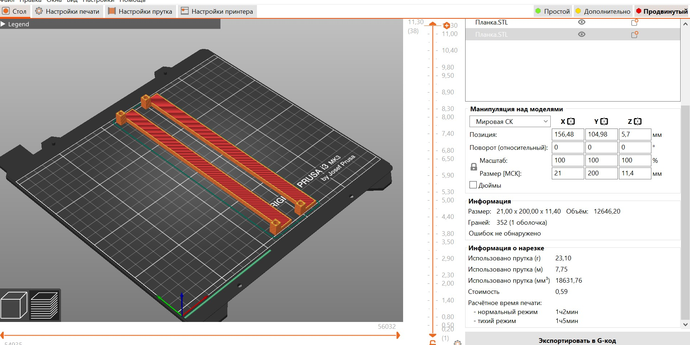
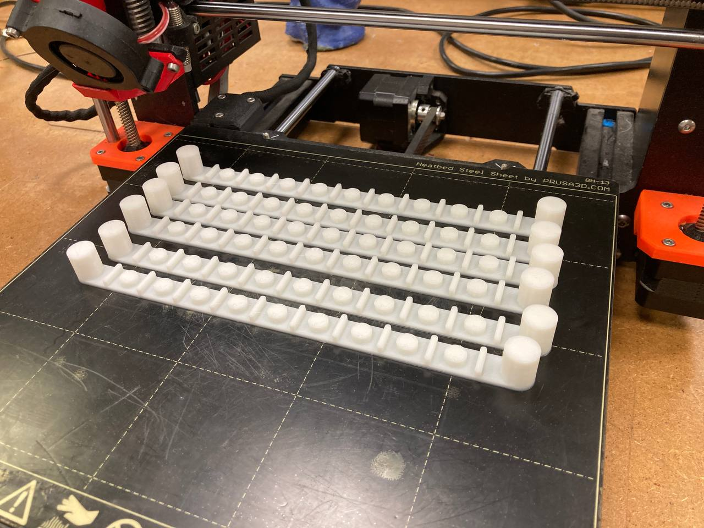
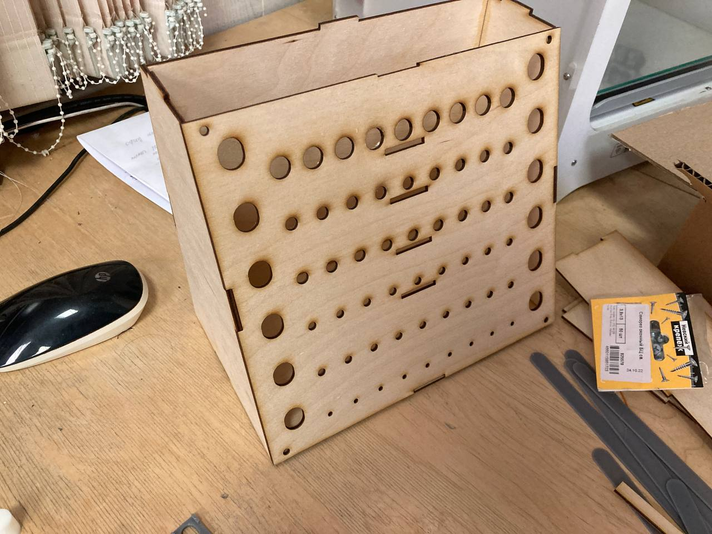
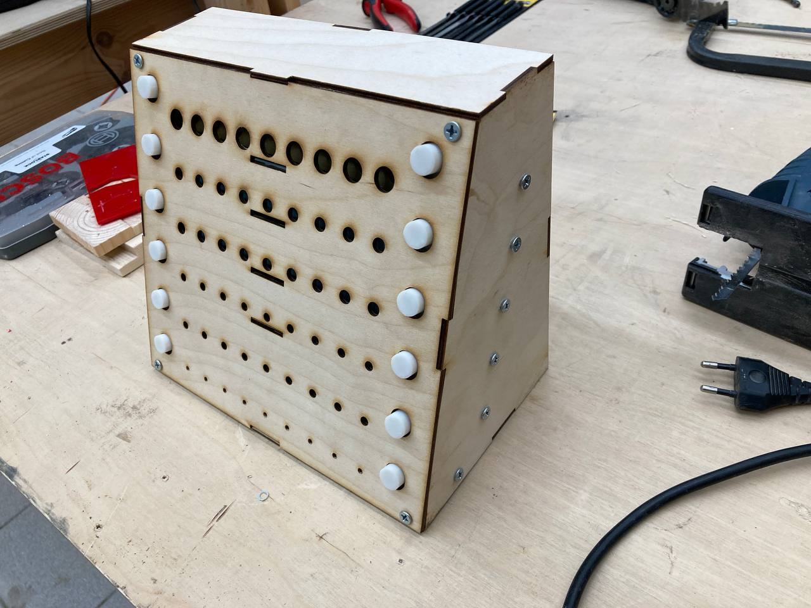

# Organaizer-for-drill

## Создание органайзера для сверл 

### Исследование

**Дано**: Сверла различных диаметров от 1.5 до 10 мм, общее количество превышает 40 штук.

Исследование началось с просмотра различных вариантов органайзеров в интернета (маркетплейсы, подделки от любителей) посредством ввода в поисковике "органайзер для сверл". Анализ результатов вывел типичную структуру для любого найденого органайзера - создание отдельного отверстия для каждого сверла. Рассмотрим несколько типичных органайзера, отличающихся друг от друга, разве что формой.

| Существующие решения      | Достоинства          | Недостатки |
|---------------------------|----------------------|------------|
|[Круглый держатель для сверл](https://darxton.ru/catalog_item/organayzer-dlya-svyerl-0-13-mm-100-predmetov/)| Много отверстий, занимает меньше места чем прямоугольная форма| Долгое время печати, нет возможности использования фанеры |
|[Органайзер с крышкой](https://aliexpress.ru/item/1005006088691748.html?sku_id=12000035679458737&spm=.search_results.2.7a9a45b48rbVsu)| Простота, защита от пыли | Не хватает отсеков |
|[Органайзер из фанеры с гравировкой для диаметров](https://ishooter.ru/product/organaizer-pod-sverla-10-99-mm-red-force-derevo.html) | Минимализм и простота | Используемый вариант, неудобный захват сверл|

**Вывод**: Так как количество сверл в будущем изменится и заранее узнать их диаметр невозможно, то было решено доработать дизайн из "Органайзер из фанеры с гравировкой для диаметров" с удобным захватом и регулируемым размером отверстий

### Доска вдохновения

[Miro. Organaizer-for-drill](https://miro.com/app/board/uXjVNaxHn4c=/?share_link_id=504908036010)

### Скетчинг

Рисунок 1 - Наброски вида органайзера и его сборочных деталей

**Решение задачи**: Каркас из фанеры, мелкие (внутрение) детали из пластика, соединение будет осуществляться через саморезы.

### Моделирование и подготовка к печати

**Программное обеспечение**: SolidWorks, CorelDraw, Prusia Slicer

Рисунок 2 - Трехмерная модель передней крышки с пластиковыми деталями

Рисунок 3 - Трехмерная модель внешнего корпуса

Рисунок 4 - Чертеж каркаса из фанеры

Все модели для корпуса и деталей сделаны в программе Solidworks, модели корпуса экспортированы в формат DWG для последующего открытия в CorelDraw и отправки на печать. Модели деталей экспортированы в формат STL для последующего слайсинга в программе Prusa Slicer.

Рисунок 5 - Создание G-кода для принтера

### Изготовление и сборка

| Материалы        | Применение         | Стоимость*        | Оборудование       | Время изготовления | 
|------------------|--------------------|-------------------|--------------------|--------------------|
|Лист фанеры 3 мм  | Каркас | 330 руб | Лазерный станок GCC Spirit GLS100 |6 минут |
|Filament PLA  | Внутрение детали | 145 руб | 3D-принтер Prusa i3 MK3 |6:20 часов |

*рассчитано, исходя из указанной в интернете стоимости материала

Рисунок 6 - Полученный элемент органайзера с помощью 3D-принтера

Рисунок 7 - Полученные элементы органайзера с помощью лазерного станка

### Предварительный результат

Рисунок 8 - Прототип будущего органайзера

**Тестирование:**

Видео вставить

**Вещи для доработки**:
1. Обработать отверстия шлифовальной машинкой, расширив их, чтобы планки и задвижки скользи по пазам.
2. Нанести на стыки клей для фиксации.

## Результат
Все стыки фанеры дополнительно обработаны клеем, после обработки отверстий детали без проблем проскальзывают как надо.

Рисунок 9 - Органайзер (вид сверху)

Рисунок 10 - Органайзер (вид сбоку)

**Тестирование:**

Вставить видео
