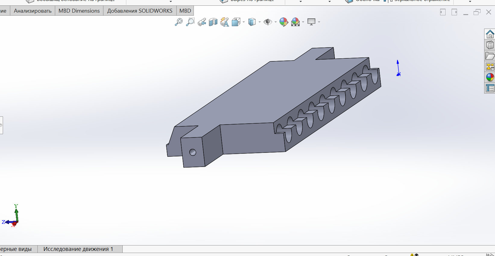
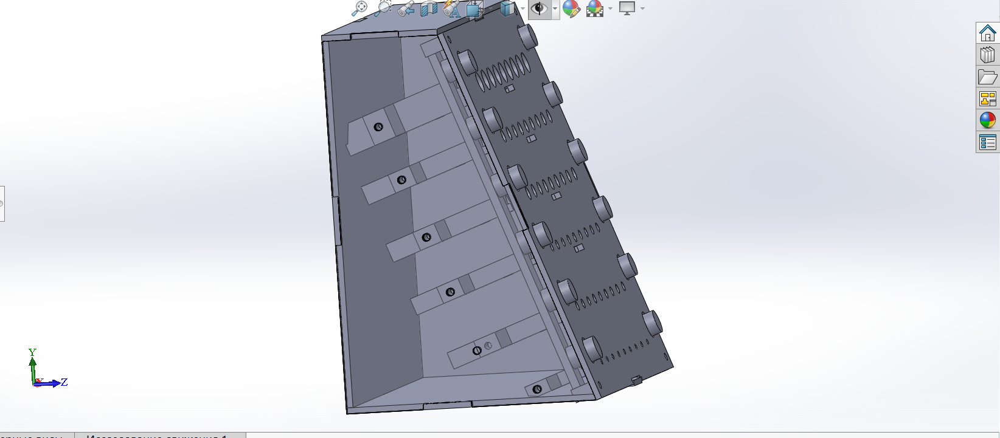
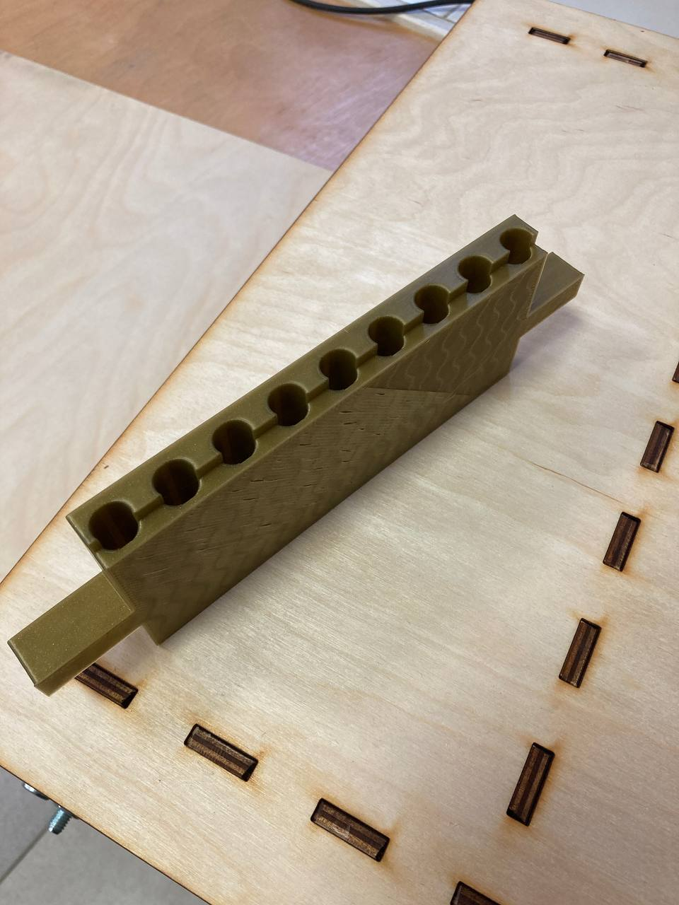
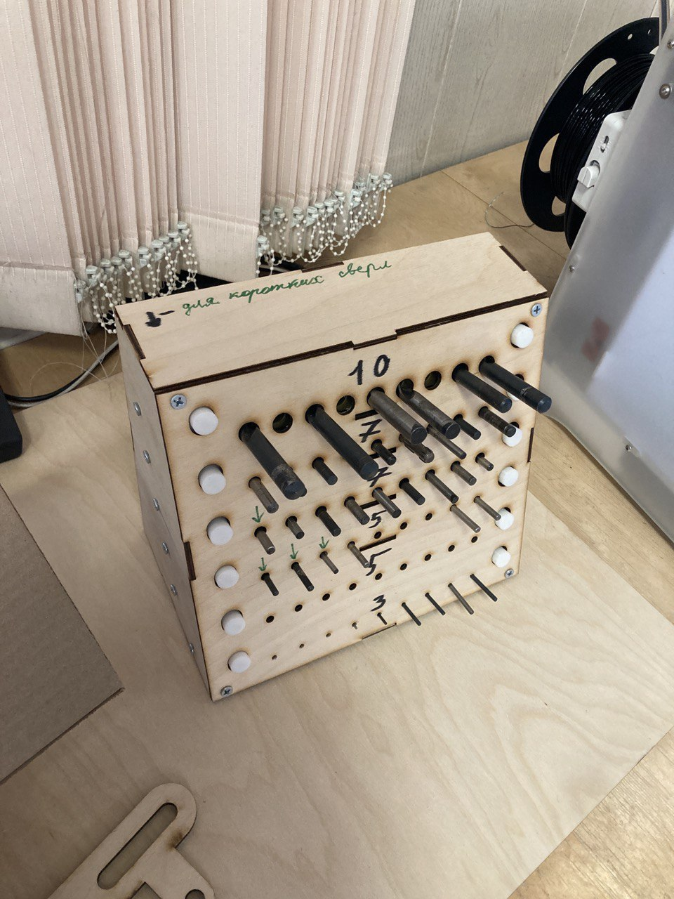
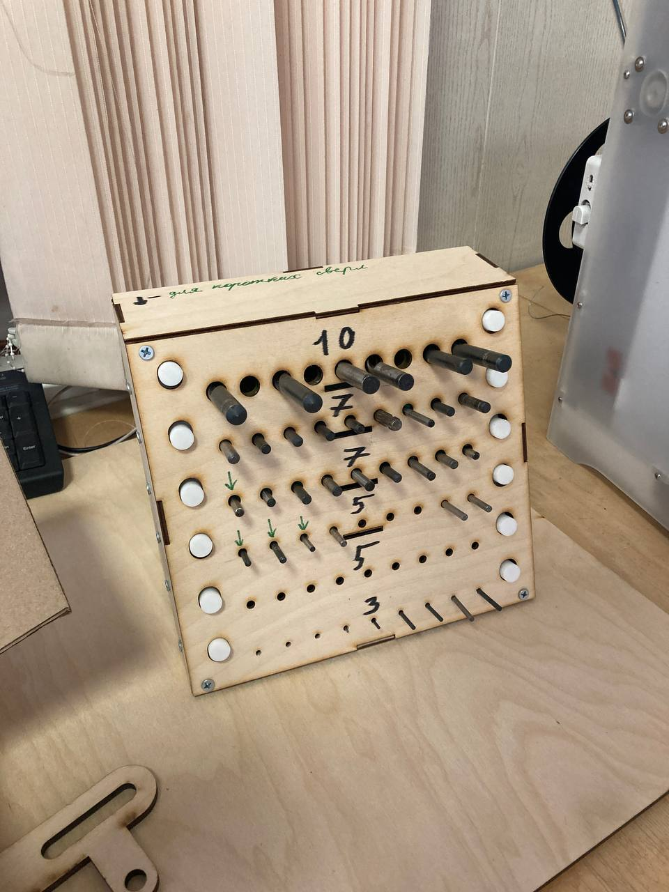

# Organaizer-for-drill

### Исследование

**Дано**: Сверла различных диаметров от 1.5 до 10 мм, общее количество превышает 40 штук.

Исследование началось с просмотра различных вариантов органайзеров в интернета (маркетплейсы, подделки от любителей) посредством ввода в поисковике "органайзер для сверл". Анализ результатов вывел типичную структуру для любого найденого органайзера - создание отдельного отверстия для каждого сверла. Рассмотрим несколько типичных органайзера, отличающихся друг от друга, разве что формой.

| Существующие решения      | Достоинства          | Недостатки |
|---------------------------|----------------------|------------|
|[Круглый держатель для сверл](https://darxton.ru/catalog_item/organayzer-dlya-svyerl-0-13-mm-100-predmetov/)| Много отверстий, занимает меньше места чем прямоугольная форма| Долгое время печати, нет возможности использования фанеры |
|[Органайзер с крышкой](https://aliexpress.ru/item/1005006088691748.html?sku_id=12000035679458737&spm=.search_results.2.7a9a45b48rbVsu)| Простота, защита от пыли | Не хватает отсеков |
|[Органайзер из фанеры с гравировкой для диаметров](https://ishooter.ru/product/organaizer-pod-sverla-10-99-mm-red-force-derevo.html) | Минимализм и простота | Используемый вариант, неудобный захват сверл|

**Вывод**: Так как количество сверл в будущем изменится и заранее узнать их диаметр невозможно, то было решено доработать дизайн из "Органайзер из фанеры с гравировкой для диаметров" с удобным захватом и регулируемым размером отверстий

### Доска вдохновения

[Miro. Organaizer-for-drill](https://miro.com/app/board/uXjVNaxHn4c=/?share_link_id=504908036010)

### Скетчинг

Рисунок 1 - Наброски вида органайзера и его сборочных деталей

**Решение задачи**: Каркас из фанеры, мелкие (внутрение) детали из пластика, соединение будет осуществляться через саморезы.

### Моделирование и подготовка к печати

**Программное обеспечение**: SolidWorks, CorelDraw, Prusia Slicer

Рисунок 2 - Трехмерная модель передней крышки с пластиковыми деталями

Рисунок 3 - Трехмерная модель внешнего корпуса

Рисунок 4 - Чертеж каркаса из фанеры

Все модели для корпуса и деталей сделаны в программе Solidworks, модели корпуса экспортированы в формат DWG для последующего открытия в CorelDraw и отправки на печать. Модели деталей экспортированы в формат STL для последующего слайсинга в программе Prusa Slicer.

Рисунок 5 - Создание G-кода для принтера

### Изготовление и сборка

| Материалы        | Применение         | Стоимость*        | Оборудование       | Время изготовления | 
|------------------|--------------------|-------------------|--------------------|--------------------|
|Лист фанеры 3 мм  | Каркас | 330 руб | Лазерный станок GCC Spirit GLS100 |6 минут |
|Filament PLA  | Внутрение детали | 145 руб | 3D-принтер Prusa i3 MK3 |6:20 часов |

*рассчитано, исходя из указанной в интернете стоимости материала

Рисунок 6 - Полученный элемент органайзера с помощью 3D-принтера

Рисунок 7 - Полученные элементы органайзера с помощью лазерного станка

### Предварительный результат

Рисунок 8 - Прототип будущего органайзера

### Тестирование:

*Видео откроется в новой вкладке

### Вещи для доработки:
1. Обработать отверстия шлифовальной машинкой, расширив их, чтобы планки и задвижки скользи по пазам.
2. Нанести на стыки клей для фиксации.
3. Планки на передней стенке упираются в основание, нужно прорезать отверстия в основании.
4. Держатели из фанеры для сверл недостатчно фиксируют их для переноски и прочего, поэтому надо будет создать ячейки для каждого ряда сверл на принтере.
5. Маркировка диаметров.

**Моделирование**

Создание держателей для сверл каждого ряда, крепящиеся на боковые стены для большей прочности конструкции

Рисунок 9 - Трехмерная модель ячеек сверл с 10 мм радиусом

Рисунок 10 - Модель органайзера в разрезе

**Печать новых компонентов**

Рисунок 11 - Готовая модель ячеек сверл с 10 мм радиусом

## Результат
Все стыки фанеры дополнительно обработаны клеем, после обработки отверстий детали без проблем проскальзывают как надо, новые ячейки для сверл придают необходимую фиксацию сверл, маркировка перелней крышки проводилась маркером.

Рисунок 12 - Органайзер (вид сверху)

Рисунок 13 - Органайзер (вид спереди)

**Тестирование:**

[Финальный результат](https://drive.google.com/file/d/1s3_rQBjPkMFttOHKlrNmcRscF6AJz6oU/view?usp=share_link)

## Оценка сборки
1. Задвижки не работают как задумывались, им не хватает веса или нажимающего усиллия на сверла;
2. Было не достатчно проверок сборки на персечения, пришлось вырезать в корпусе отверстия, чтобы влезло все;
3. Нужны маркировки под каждое сверло для быстрого нахождения сверл, но это идет против концепции универсального отверстия.
